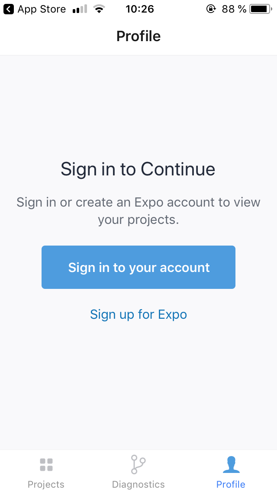

## Introduction
It's a mobile implementation of Zold Wallet for both `IOS` and `Android` platforms using `react-native` framework.
It uses [zold-node-sdk](https://github.com/vryazanov/zold-node-sdk) under the hood.

Feel free to contribute.

## How to run application on device for testing
1. Download `Expo Client` from `App Store` / `Play Market` (`App Store`: https://itunes.apple.com/us/app/expo-client/id982107779
2. Open Expo Client and sign up, it takes two minutes. No email verification required.
  
  
3. Open `exp://exp.host/@vryazanov/zold-mobile-wallet` from your mobile browser or scan QR code from https://expo.io/@vryazanov/zold-mobile-wallet
4. Application will be opened in Expo and will be available there on your device: 

All application updates will be synced automatically.

## How to run locally
It's pretty easy to start application on real device using `expo`. Do the following steps:
1. Clone the repo and execute `npm install` inside
2. Download `Expo` application from `Play Market` / `Apple Store`.
3. Open application and sign up.
4. Inside the repo execute `npm run start`. Browse page with the following URL will be opened: `http://localhost:19002/`
5. In the left bottom side of the page there will be a QR code (or you can just open URL in the mobile browser, the link will be provided near QR code), scan it and open from your mobile. Also you can send the link via sms or email.
6. That's it. `Expo` will open the application.

Every time you change the code, `Expo` will refresh the app in your mobile.